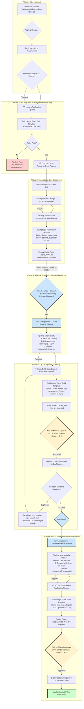

```mermaid
graph TD
    subgraph "Phase 1: Development"
        A[Developer creates 'feature/login' branch from 'develop'] --> B{Work on Feature};
        B --> C[Push commits to 'feature/login'];
        C --> D{Open Pull Request to 'develop'};
    end

    subgraph "Phase 2: PR Validation (Automated Quality Gate)"
        D --> E[PR triggers Application Pipeline];
        E --> F["Build Stage: Runs 'Build' Template <br>(Compiles & Unit Tests)"];
        F --> G{Tests Pass?};
        G -- No --> H[Pipeline Fails. <br>PR is blocked. <br>Developer must fix.];
        G -- Yes --> I[PR Check is Green. <br>Ready for Code Review.];
    end
    
    subgraph "Phase 3: Integration & Dev Deployment"
        I --> J[Team reviews & approves PR];
        J --> K[Complete PR & Merge code into 'develop'];
        K --> L["'develop' branch push triggers Application Pipeline"];
        L --> M["Build Stage: Runs 'Build' Template <br>(Builds Docker image, tags as 'dev-commit', pushes to ACR)"];
        M --> N["Deploy Stage: Runs 'Deploy_Dev' Job <br>(Deploys to DEV Cluster)"];
    end

    %% This dotted line shows that after a period of successful development,
    %% a manual decision is made to start the release process.
    N-.->|"When 'develop' branch is ready"|O

    subgraph "Phase 4: Release Preparation (Manual Decision)"
        %% CORRECTED NODE O
        O{"Time for a new Release?
        (Manual Decision by Release Manager)"} -- Yes --> P["Run 'Management - Create Release' Pipeline"];
        P --> Q["Pipeline automatically:
        1. Checks out 'develop'
        2. Calculates next version (e.g., 1.3.0)
        3. Creates 'release/1.3.0' branch"];
    end

    subgraph "Phase 5: QA Deployment & Testing"
        Q --> R["'release/1.3.0' push triggers Application Pipeline"];
        R --> S["Build Stage: Runs 'Build' Template <br>(Builds Docker image, tags as 'release-1.3.0-rc', pushes to ACR)"];
        S --> T["Deploy Stage: 'Deploy_QA' Jobs are triggered"];
        T --> U{"Wait for Manual Approval <br>on 'QA Environment - Region 1 & 2'"};
        U -- Approved --> V["Deploy Jobs run in parallel to QA Clusters"];
        V --> W{QA Team Tests the Application};
        W -- Bug Found --> X["Developer fixes bug in a new branch from 'release/1.3.0' and merges it back."];
        X --> R;
        W -- All Good --> Y{QA Sign-off};
    end

    subgraph "Phase 6: Production Release (Final Approval)"
        Y --> Z["Run 'Management - Finalize Release' Pipeline"];
        Z --> AA["Pipeline automatically:
        1. Merges 'release/1.3.0' to 'main'
        2. Creates 'v1.3.0' tag on 'main'
        3. Merges 'release/1.3.0' to 'develop'"];
        AA --> BB["'v1.3.0' tag push triggers Application Pipeline"];
        BB --> CC["Build Stage: Runs 'Build' Template <br>(Builds final image, tags as '1.3.0', pushes to ACR)"];
        CC --> DD["Deploy Stage: 'Deploy_Prod' Jobs are triggered"];
        DD --> EE{"Wait for Manual Approval <br>on 'PROD Environment - Region 1 & 2'"};
        EE -- Approved --> FF["Deploy Jobs run in parallel to PROD Clusters"];
        FF --> GG[Application is LIVE in Production!];
    end

    %% --- Connecting the Phases ---
    D -- "Triggers" --> E
    K -- "Triggers" --> L
    Q -- "Triggers" --> R
    AA -- "Triggers" --> BB

    style H fill:#ffcccc,stroke:#333,stroke-width:2px
    style O fill:#cce5ff,stroke:#333,stroke-width:2px
    style U fill:#fff2cc,stroke:#333,stroke-width:2px
    style Y fill:#cce5ff,stroke:#333,stroke-width:2px
    style Z fill:#cce5ff,stroke:#333,stroke-width:2px
    style P fill:#cce5ff,stroke:#333,stroke-width:2px
    style EE fill:#fff2cc,stroke:#333,stroke-width:2px
    style GG fill:#ccffcc,stroke:#333,stroke-width:4px
```